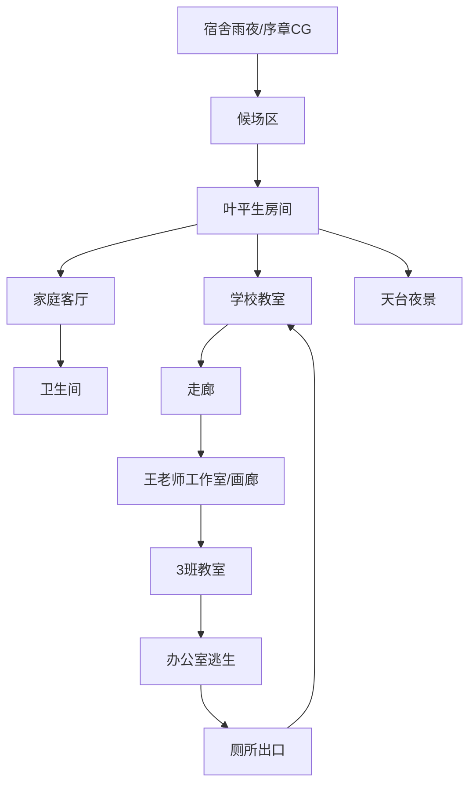
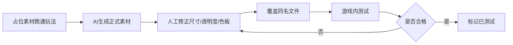

# 04｜《快乐小孩》占位素材与地图规划规范 v0.1

> 用途：AI素材未完成前，先用占位素材跑通地图、碰撞、对话、触发、存档流程。

## 1. 占位素材原则

- 文件名尽量与最终素材一致，后续直接覆盖。
- 先保证功能，不追求美术效果。
- 地图中必须清楚区分：可行走区、不可通行区、NPC、调查点、门、剧情触发区。

## 2. 占位目录

```text
assets/
  placeholder/
    tileset_basic.png
    player_block.png
    npc_block_blue.png
    npc_block_red.png
    item_marker.png
    cg_placeholder.png
    fx_red_overlay.png
```

## 3. 地图关系图



## 4. Tiled 图层规范

每张地图建议包含：

```text
Ground      地面层
Wall        墙体/不可通行层
Objects     家具/物件层
Collision   碰撞层
Triggers    剧情触发区
NPC         NPC出生点
Items       可调查物件
Effects     特效覆盖点
```

对象命名：

```text
trigger_剧情名
npc_角色名
item_物件名
door_目标地图名
spawn_出生点名
```

示例：

```text
trigger_read_planbook
trigger_mirror_warning
npc_liuyu
item_rule_paper
door_corridor
spawn_bedroom_start
```

## 5. 各地图占位设计

### 5.0 大地图设计原则

本项目所有地图（含走廊、操场等大场景）均采用 **整张长图 + 镜头跟随** 方案，无需分区拼接。

| 地图类型 | 典型场景 | 视口覆盖 | 建议尺寸 | 相机行为 |
|---------|---------|----------|---------|---------|
| 单屏 | 卫生间、卧室 | ≤1屏 | ≤960×540 | 不滚动 |
| 中等 | 客厅、教室 | 1~2屏 | 960~2000 px | 少量滚动 |
| 大地图 | 走廊、操场→校门 | 3~6屏 | 2000~6000 px | 大幅滚动跟随 |

- 所有场景统一使用 **Image Layer** 作为地面层（手绘风格不适合 tile 重复）
- Phaser 相机 `startFollow` 自动跟随玩家，代码零额外成本
- 仅当地图超过 8000px 时才考虑分区（本项目所有场景均不超此阈值）
- 不同地图之间通过 door trigger + fadeIn/Out 切换

### 5.1 叶平生房间 bedroom

```text
+----------------------+
| 书架    书桌/计划表   |
|                      |
|        床            |
|                      |
| 衣柜        门       |
+----------------------+
```

交互点：

| object_id | 功能 | 剧情节点ID | 备注 |
|---|---|---|---|
| item_planbook | 阅读计划表/规则 | [待填] | [待填] |
| item_bag | 藏行囊 | [待填] | [待填] |
| door_livingroom | 切换客厅 | [待填] | [待填] |

### 5.2 家庭客厅 livingroom

```text
+----------------------+
| 全家福       挂钟     |
|                      |
| 茶几      沙发        |
|                      |
| 门   厨房门  卫生间门 |
+----------------------+
```

交互点：

| object_id | 功能 | 剧情节点ID | 备注 |
|---|---|---|---|
| item_family_photo | 观察全家福 | [待填] | [待填] |
| item_trash_rule | 翻垃圾桶获得规则纸 | [待填] | [待填] |
| door_bathroom | 进入卫生间 | [待填] | [待填] |

### 5.3 普通教室 classroom

```text
+--------------------------+
| 黑板/规则纸              |
|                          |
| 课桌 课桌 课桌 课桌       |
| 课桌 课桌 空座 课桌       |
| 课桌 课桌 课桌 课桌       |
|                    门    |
+--------------------------+
```

交互点：

| object_id | 功能 | 剧情节点ID | 备注 |
|---|---|---|---|
| item_class_rule | 阅读学校规则 | [待填] | [待填] |
| item_empty_seat | 调查多出来的座位 | [待填] | [待填] |
| npc_liuyu | 对话/线索释放 | [待填] | [待填] |
| npc_zhouqr | 对话/是或否提问 | [待填] | [待填] |

### 5.4 王老师工作室/画廊 wang_gallery

```text
+----------------------------+
| 画框 画框 画框   堆积画材   |
|                            |
|        画廊通道             |
|                            |
| 办公桌 王老师 周隽秀        |
+----------------------------+
```

交互点：

| object_id | 功能 | 剧情节点ID | 备注 |
|---|---|---|---|
| npc_wang | 王老师交易 | [待填] | [待填] |
| npc_zhoujx | 获取3班权限 | [待填] | [待填] |
| item_painting_doll | 被囚禁人偶画 | [待填] | [待填] |
| item_art_materials | 违规提醒，不可乱动 | [待填] | [待填] |

### 5.5 3班教室 classroom_3

```text
+---------------------------+
| 后黑板/外来者规则         |
|                           |
| 课桌 课桌 课桌 课桌 课桌   |
| 课桌 课桌 课桌 课桌 课桌   |
|                           |
|                    锁门   |
+---------------------------+
```

关键演出：

- [ ] 玩家调查后黑板
- [ ] 全班学生同时转头
- [ ] 门锁死
- [ ] 倒计时
- [ ] 晚自习铃响后门打开
- [ ] 逃回普通教室

### 5.6 天台 rooftop

```text
+----------------------------+
|         城市夜景背景        |
|                            |
|        可行走天台区域       |
|                            |
| 栏杆                       |
+----------------------------+
```

交互点：

| object_id | 功能 | 剧情节点ID | 备注 |
|---|---|---|---|
| trigger_rooftop_dialogue | 与“我”的对话 | [待填] | [待填] |
| item_city_lights | 观察城市 | [待填] | [待填] |
| item_wind | 感官引导 | [待填] | [待填] |

### 5.7 学校走廊 corridor（大地图）

建议尺寸：3200×640 px（约 5 屏宽，线性场景）

```text
教室门          布告栏               画廊门
  |              |                    |
  v              v                    v
+--+----------+--+--+-------------+--+--+----------+
|  |  储物柜  |     |   走廊通道   |     |  画框     |
|  |          |     |              |     |          |
|  |          |     |              |     |          |
+--+----------+-----+--------------+-----+----------+
```

交互点：

| object_id | 功能 | 剧情节点ID | 备注 |
|---|---|---|---|
| door_classroom | 返回教室 | [待填] | 走廊东端 |
| door_gallery | 进入画廊 | [待填] | 走廊西端 |
| item_bulletin_board | 阅读布告栏 | [待填] | 走廊中部 |
| item_locker | 翻储物柜 | [待填] | 可选交互 |
| trigger_corridor_chase | 走廊追逐/逃亡 | [待填] | 条件触发 |

**大地图特点**：
- 底图 `走廊.png` 尺寸 3200×640，相机自动跟随玩家滚动
- 两侧多个出生点：`spawn_corridor_classroom`（东端）、`spawn_corridor_gallery`（西端）
- 走廊中段可设置自动触发区（无需按 E，走入即触发）

### 5.8 操场→校门 playground_gate（大地图）

建议尺寸：4000×800 px（约 5~6 屏宽，开阔场景）

```text
教学楼入口             旗台              校门
  |                    |                 |
  v                    v                 v
+--+----------------+--+--+----------+--+--+--------+
|  |    操场         |     |   跑道   |     |  校道  |
|  |                | 旗杆 |          |     |        |
|  |    空地         |     |          |     | 保安室 |
|  |                |     |          |     |        |
+--+----------------+-----+----------+-----+--------+
```

交互点：

| object_id | 功能 | 剧情节点ID | 备注 |
|---|---|---|---|
| door_school_building | 进入教学楼 | [待填] | 操场东端 |
| item_flagpole | 旗台互动 | [待填] | 操场中部 |
| item_gate | 校门/出校 | [待填] | 场景西端 |
| item_security_room | 保安室 | [待填] | 校门旁 |
| trigger_playground_event | 操场集体事件 | [待填] | 条件触发（如祈愿仪式） |

**大地图特点**：
- 底图 `操场校门.png` 尺寸 4000×800，相机自动跟随
- 场景开阔，可行走区域大于走廊
- 旗台处可设置大面积 trigger zone（自动触发集体事件）

## 6. 替换流程



## 7. 待补充

- [ ] 每张地图实际尺寸
- [ ] 每张地图碰撞层规则
- [ ] 每个触发点对应剧情 ID
- [ ] 占位素材初版图
- [ ] AI素材替换时间表
