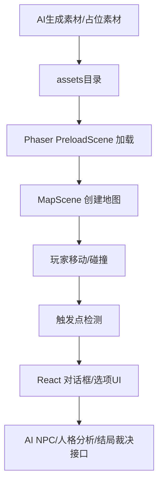
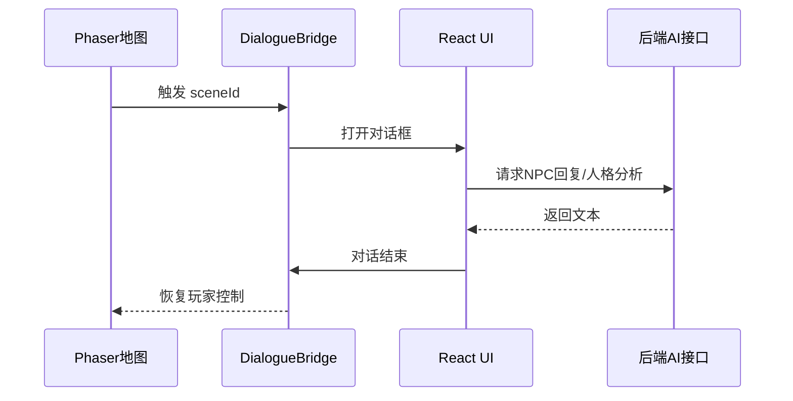

# 05｜Phaser资源加载框架说明 v0.1

> 用途：给 CodeBuddy/编程 AI 查看，说明如何加载 AI 生成的地图、角色、UI、特效、音频。当前目标：先用占位素材跑通，再替换为 AI 素材。

## 1. 技术结构概览



## 2. 目录结构建议

```text
client/
  src/
    game/
      scenes/
        BootScene.ts
        PreloadScene.ts
        MapScene.ts
        DialogueBridge.ts
      config/
        assetManifest.ts
        mapRegistry.ts
        animationRegistry.ts
      systems/
        PlayerController.ts
        InteractionSystem.ts
        TriggerSystem.ts
      types/
        gameAssets.ts
  public/
    assets/
      maps/
        bedroom/map.json
        bedroom/tileset.png
        classroom/map.json
        classroom/tileset.png
      sprites/yps_walk.png
      sprites/liuyu_walk.png
      portraits/liuyu_smile.png
      ui/dialogue_box.png
      effects/suffocation.png
      audio/sfx_system_beep.mp3
```

## 3. AssetManifest 示例

```ts
export const AssetManifest = {
  maps: {
    bedroom: {
      key: "map_bedroom",
      json: "/assets/maps/bedroom/map.json",
      tilesetKey: "tileset_bedroom",
      tilesetImage: "/assets/maps/bedroom/tileset.png",
    },
    classroom: {
      key: "map_classroom",
      json: "/assets/maps/classroom/map.json",
      tilesetKey: "tileset_classroom",
      tilesetImage: "/assets/maps/classroom/tileset.png",
    },
  },
  sprites: {
    yps: {
      key: "sprite_yps_walk",
      image: "/assets/sprites/yps_walk.png",
      frameWidth: 32,
      frameHeight: 48,
    },
    liuyu: {
      key: "sprite_liuyu_walk",
      image: "/assets/sprites/liuyu_walk.png",
      frameWidth: 32,
      frameHeight: 48,
    },
  },
  effects: {
    suffocation: {
      key: "fx_suffocation",
      image: "/assets/effects/suffocation.png",
    },
  },
  audio: {
    systemBeep: {
      key: "sfx_system_beep",
      path: "/assets/audio/sfx_system_beep.mp3",
    },
  },
} as const;
```

待填：

```text
实际地图列表：
实际 sprite 列表：
实际 UI 资源：
实际音频：
```

## 4. PreloadScene 职责

- 加载 Tiled 地图 JSON
- 加载 tileset 图片
- 加载角色 sprite sheet
- 加载 UI、特效、音频
- 显示加载进度
- 加载完成后进入主地图

伪代码：

```ts
export class PreloadScene extends Phaser.Scene {
  constructor() {
    super("PreloadScene");
  }

  preload() {
    Object.values(AssetManifest.maps).forEach((map) => {
      this.load.tilemapTiledJSON(map.key, map.json);
      this.load.image(map.tilesetKey, map.tilesetImage);
    });

    Object.values(AssetManifest.sprites).forEach((sprite) => {
      this.load.spritesheet(sprite.key, sprite.image, {
        frameWidth: sprite.frameWidth,
        frameHeight: sprite.frameHeight,
      });
    });
  }

  create() {
    this.scene.start("MapScene", { mapId: "bedroom" });
  }
}
```

## 5. MapRegistry 示例

```ts
export const MapRegistry = {
  bedroom: {
    mapKey: "map_bedroom",
    tilesetNameInTiled: "tileset_bedroom",
    tilesetKey: "tileset_bedroom",
    defaultSpawn: "spawn_bedroom_start",
    bgm: null,
  },
  classroom: {
    mapKey: "map_classroom",
    tilesetNameInTiled: "tileset_classroom",
    tilesetKey: "tileset_classroom",
    defaultSpawn: "spawn_classroom_door",
    bgm: "bgm_classroom",
  },
} as const;
```

## 6. AnimationRegistry 示例

假设 sprite sheet 排列：0-3向下，4-7向左，8-11向右，12-15向上。

```ts
export function createPlayerAnimations(scene: Phaser.Scene) {
  scene.anims.create({
    key: "yps_walk_down",
    frames: scene.anims.generateFrameNumbers("sprite_yps_walk", { start: 0, end: 3 }),
    frameRate: 8,
    repeat: -1,
  });
  scene.anims.create({
    key: "yps_walk_left",
    frames: scene.anims.generateFrameNumbers("sprite_yps_walk", { start: 4, end: 7 }),
    frameRate: 8,
    repeat: -1,
  });
  scene.anims.create({
    key: "yps_walk_right",
    frames: scene.anims.generateFrameNumbers("sprite_yps_walk", { start: 8, end: 11 }),
    frameRate: 8,
    repeat: -1,
  });
  scene.anims.create({
    key: "yps_walk_up",
    frames: scene.anims.generateFrameNumbers("sprite_yps_walk", { start: 12, end: 15 }),
    frameRate: 8,
    repeat: -1,
  });
}
```

## 7. Tiled 对象属性建议

| 属性名 | 用途 | 示例 |
|---|---|---|
| type | 触发类型 | dialogue / item / door / effect |
| sceneId | 剧情节点 | scene_read_planbook |
| targetMap | 目标地图 | classroom |
| spawnId | 目标出生点 | spawn_classroom_door |
| npcId | NPC编号 | liuyu |
| itemId | 物件编号 | planbook |
| requireFlag | 前置条件 | has_3class_permission |
| setFlag | 触发后设置条件 | read_family_rule |

## 8. React 与 Phaser 交互桥



接口占位：

```ts
type DialogueEvent = {
  sceneId: string;
  npcId?: string;
  itemId?: string;
  mapId: string;
};

type DialogueResult = {
  nextSceneId?: string;
  setFlags?: string[];
  changeMap?: {
    mapId: string;
    spawnId: string;
  };
};
```

## 9. CodeBuddy 任务清单

```text
请根据本文件生成 Phaser + React 的资源加载系统：
1. 创建 AssetManifest；
2. 创建 PreloadScene；
3. 创建 MapRegistry；
4. 创建 MapScene；
5. 读取 Tiled 对象层 Triggers/NPC/Items；
6. 实现玩家移动与碰撞；
7. 实现按 E 键交互；
8. 通过 DialogueBridge 通知 React 显示剧情；
9. 支持后续替换 AI 生成素材。
```

## 10. 待补充

- [ ] 实际项目目录
- [ ] Tiled JSON样例
- [ ] 第一张地图加载测试结果
- [ ] React DialogueBridge 真实代码
