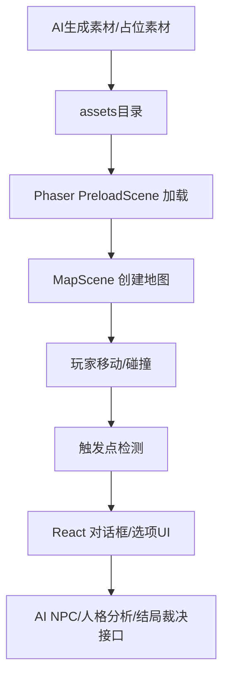
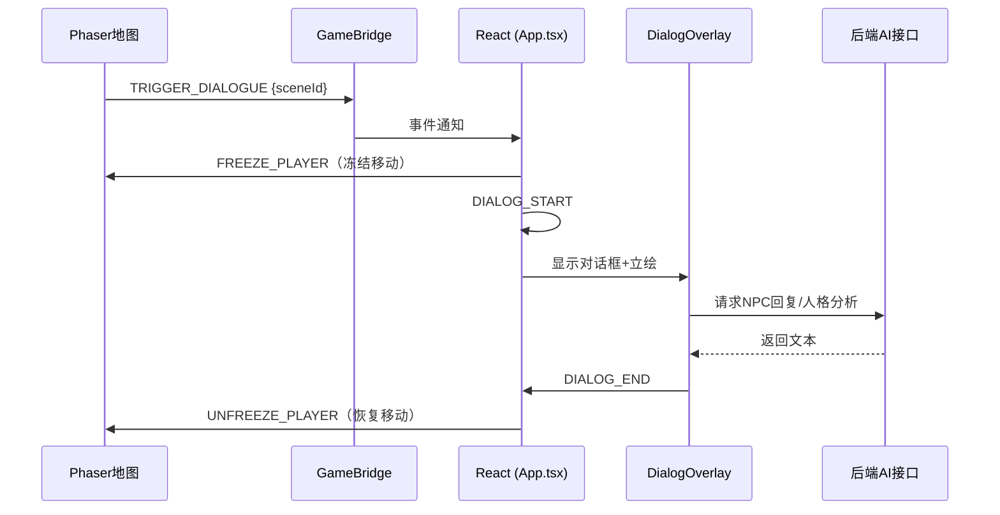

# 05｜Phaser资源加载框架说明 v0.1

> 用途：给 CodeBuddy/编程 AI 查看，说明如何加载 AI 生成的地图、角色、UI、特效、音频。当前目标：先用占位素材跑通，再替换为 AI 素材。

## 1. 技术结构概览



## 2. 目录结构建议

```text
client/
  src/
    game/
      scenes/
        BootScene.ts
        PreloadScene.ts
        MapScene.ts
      bridge/
        GameBridge.ts
      config/
        assetManifest.ts
        mapRegistry.ts
        animationRegistry.ts
      systems/
        PlayerController.ts
        InteractionSystem.ts
        TriggerSystem.ts
      types/
        gameMap.ts
    components/
      PhaserContainer.tsx
      DialogOverlay.tsx
  public/
    assets/
      maps/
        livingroom/map.json
        livingroom/客厅.png
        bedroom/map.json
        bedroom/主角房间.png
        bathroom/map.json
        bathroom/卫生间.png
      sprites/
        cyh.png
        roommateA.png
        roommateB.png
        shop_assistant_female.png
        shop_assistant_male.png
        frames/               # 角色PNG帧（运行时加载）
          cyh_frames/
            cyh_frames_left/frame_00.png ~ frame_05.png  # 6帧跑步
            cyh_frames_right/frame_00.png ~ frame_05.png # 6帧跑步（向右）
            cyh_frames_stand_left/frame_00.png           # 1帧站立
            cyh_frames_stand_right/frame_00.png          # 1帧站立（向右）
            ...
          roommateA_frames/
            ...
          yps_frames/
            yps_frames_left/frame_00.png ~ frame_05.png
            ...
      portraits/yps_defult.png
      portraits/ly_smile.png
      ui/dialogue_box.png
      effects/
      audio/
```

> **已删除**：`bg/` 和 `characters/` 文件夹。场景背景改用 Phaser 像素地图，角色改用 `portraits/` 立绘。
> 
> **工作流程**：角色PNG帧由AI美术工具直接分割生成，无需通过GIF中间格式。每个角色在 `sprites/frames/` 下有自己的目录，包含各方向的PNG帧。

## 3. AssetManifest 示例

> **当前方案（v8.3）**：角色动画使用AI工具直接分割的独立PNG帧（含 right 方向），无需spritesheet或GIF中间格式，在PreloadScene中通过循环动态加载。

```ts
export const AssetManifest = {
  maps: {
    bedroom: {
      key: "map_bedroom",
      json: "/assets/maps/bedroom/map.json",
      tilesetKey: "tileset_bedroom",
      tilesetImage: "/assets/maps/bedroom/tileset.png",
    },
    classroom: {
      key: "map_classroom",
      json: "/assets/maps/classroom/map.json",
      tilesetKey: "tileset_classroom",
      tilesetImage: "/assets/maps/classroom/tileset.png",
    },
  },
  // 角色精灵帧在PreloadScene中动态加载（无需在此列出）
  portraits: {
    yps_default: {
      key: "portrait_yps_default",
      image: "/assets/portraits/yps_default.png",
    },
    liuyu_smile: {
      key: "portrait_liuyu_smile",
      image: "/assets/portraits/liuyu_smile.png",
    },
  },
  effects: {
    suffocation: {
      key: "fx_suffocation",
      image: "/assets/effects/suffocation.png",
    },
  },
  audio: {
    systemBeep: {
      key: "sfx_system_beep",
      path: "/assets/audio/sfx_system_beep.mp3",
    },
  },
} as const;
```

> **历史方案**：之前使用单张 256×256 spritesheet + `generateFrameNumbers`，操作复杂且帧坐标难以维护，已废弃。

待填：

```text
实际地图列表：
实际 sprite 列表：
实际 UI 资源：
实际音频：
```

## 4. PreloadScene 职责

- 加载 Tiled 地图 JSON
- 加载 tileset 图片
- 加载角色精灵帧（独立PNG帧，每帧单独加载）
- 加载立绘、UI、特效、音频
- 显示加载进度
- 加载完成后注册动画，进入主地图

核心代码：

```ts
export class PreloadScene extends Phaser.Scene {
  constructor() {
    super("PreloadScene");
  }

  preload() {
    // ... 加载地图等资源 ...

    // 加载角色精灵帧（独立PNG帧）
    const charDirs = ["cyh_frames", "roommateA_frames", "roommateB_frames", "shop_assistant_female_frames", "shop_assistant_male_frames", "yps_frames"];
    const runDirections = ["left", "right", "front", "back"];    // 6帧跑步
    const staticDirections = ["sit_left", "sit_right", ...];     // 1帧坐下/站立
    
    for (const charDir of charDirs) {
      // 跑步帧（每个方向6帧）
      for (const dir of runDirections) {
        for (let i = 0; i < 6; i++) {
          const key = `${charDir}_${dir}_${i}`;
          const path = `/assets/sprites/frames/${charDir}/${charDir}_${dir}/frame_0${i}.png`;
          this.load.image(key, path);
        }
      }
      // 坐下/站立帧（每个方向1帧）
      for (const dir of staticDirections) {
        const key = `${charDir}_${dir}_0`;
        const path = `/assets/sprites/frames/${charDir}/${charDir}_${dir}/frame_00.png`;
        this.load.image(key, path);
      }
    }
  }

  create() {
    createPlayerAnimations(this);  // 注册动画
    this.scene.start("MapScene", { mapId: "livingroom" });
  }
}
```
    });
  }

  create() {
    this.scene.start("MapScene", { mapId: "bedroom" });
  }
}
```

## 5. MapRegistry 示例

```ts
export const MapRegistry = {
  bedroom: {
    mapKey: "map_bedroom",
    tilesetNameInTiled: "tileset_bedroom",
    tilesetKey: "tileset_bedroom",
    defaultSpawn: "spawn_bedroom_start",
    bgm: null,
  },
  classroom: {
    mapKey: "map_classroom",
    tilesetNameInTiled: "tileset_classroom",
    tilesetKey: "tileset_classroom",
    defaultSpawn: "spawn_classroom_door",
    bgm: "bgm_classroom",
  },
} as const;
```

## 6. AnimationRegistry 示例

> **当前方案（v8.3）**：使用AI工具分割的独立PNG帧，每个方向独立目录（含 right），帧键名清晰可读。
> 
> - 跑步：6帧循环（`frameRate=10, repeat=-1`）
> - 站立：1帧静态（`frameRate=1, repeat=0`）
> - 坐下：1帧静态（`frameRate=1, repeat=0`）
> - 向右：使用独立 right 帧注册动画，无需 `setFlipX`

```ts
// 辅助函数：生成帧引用
function createFrames(charName: string, dirName: string, count: number) {
  return Array.from({ length: count }, (_, i) => ({
    key: `${charName}_frames_${dirName}_${i}`,
  }));
}

export function createPlayerAnimations(scene: Phaser.Scene) {
  // ========== 叶平生（yps）动画 ==========
  // 向左（跑步6帧 + 站立1帧 + 坐下1帧）
  scene.anims.create({ key: "yps_run_left", frames: createFrames("yps", "left", 6), frameRate: 10, repeat: -1 });
  scene.anims.create({ key: "yps_idle_left", frames: [{ key: "yps_frames_stand_left_0" }], frameRate: 1, repeat: 0 });
  scene.anims.create({ key: "yps_sit_left", frames: [{ key: "yps_frames_sit_left_0" }], frameRate: 1, repeat: 0 });

  // 向上（back方向）
  scene.anims.create({ key: "yps_run_up", frames: createFrames("yps", "back", 6), frameRate: 10, repeat: -1 });
  scene.anims.create({ key: "yps_idle_up", frames: [{ key: "yps_frames_stand_back_0" }], frameRate: 1, repeat: 0 });
  scene.anims.create({ key: "yps_sit_up", frames: [{ key: "yps_frames_sit_back_0" }], frameRate: 1, repeat: 0 });

  // 向下（front方向）
  scene.anims.create({ key: "yps_run_down", frames: createFrames("yps", "front", 6), frameRate: 10, repeat: -1 });
  scene.anims.create({ key: "yps_idle_down", frames: [{ key: "yps_frames_stand_front_0" }], frameRate: 1, repeat: 0 });
  scene.anims.create({ key: "yps_sit_down", frames: [{ key: "yps_frames_sit_front_0" }], frameRate: 1, repeat: 0 });

  // 向右（right方向，独立帧）
  scene.anims.create({ key: "yps_run_right", frames: createFrames("yps", "right", 6), frameRate: 10, repeat: -1 });
  scene.anims.create({ key: "yps_idle_right", frames: [{ key: "yps_frames_stand_right_0" }], frameRate: 1, repeat: 0 });
  scene.anims.create({ key: "yps_sit_right", frames: [{ key: "yps_frames_sit_right_0" }], frameRate: 1, repeat: 0 });
}
```

> **历史方案**：之前使用单张spritesheet + `generateFrameNumbers` 手动指定帧坐标，维护困难，已废弃。

## 7. Tiled 对象属性建议

| 属性名 | 用途 | 示例 |
|---|---|---|
| type | 触发类型 | dialogue / item / door / effect |
| sceneId | 剧情节点 | scene_read_planbook |
| targetMap | 目标地图 | classroom |
| spawnId | 目标出生点 | spawn_classroom_door |
| npcId | NPC编号 | liuyu |
| itemId | 物件编号 | planbook |
| requireFlag | 前置条件 | has_3class_permission |
| setFlag | 触发后设置条件 | read_family_rule |

## 8. React 与 Phaser 交互桥

当前采用**融合架构**：Phaser 地图始终可见，对话以 DialogOverlay 浮动叠层呈现。



> **关键变化**：不再使用"双模式切换"（explore ↔ narrative），Phaser 场景**始终可见**。对话作为叠层显示在 Phaser 上方。

事件定义：

```ts
// Phaser → React（触发事件）
type PhaserToReactEvent =
  | { type: "TRIGGER_DIALOGUE"; sceneId: string; mapId: string }
  | { type: "TRIGGER_ITEM"; itemId: string; mapId: string }
  | { type: "TRIGGER_DOOR"; targetMap: string; spawnId: string };

// React → Phaser（控制指令）
type ReactToPhaserCommand =
  | { type: "CHANGE_MAP"; mapId: string; spawnId: string }
  | { type: "FREEZE_PLAYER" }
  | { type: "UNFREEZE_PLAYER" };
```

## 9. CodeBuddy 任务清单

```text
请根据本文件生成 Phaser + React 的资源加载系统：
1. 创建 AssetManifest；
2. 创建 PreloadScene；
3. 创建 MapRegistry；
4. 创建 MapScene；
5. 读取 Tiled 对象层 Triggers/NPC/Items；
6. 实现玩家移动与碰撞；
7. 实现按 E 键交互；
8. 通过 DialogueBridge 通知 React 显示剧情；
9. 支持后续替换 AI 生成素材。
```

## 10. 待补充

- [ ] 实际项目目录
- [ ] Tiled JSON样例
- [ ] 第一张地图加载测试结果
- [ ] React DialogueBridge 真实代码
