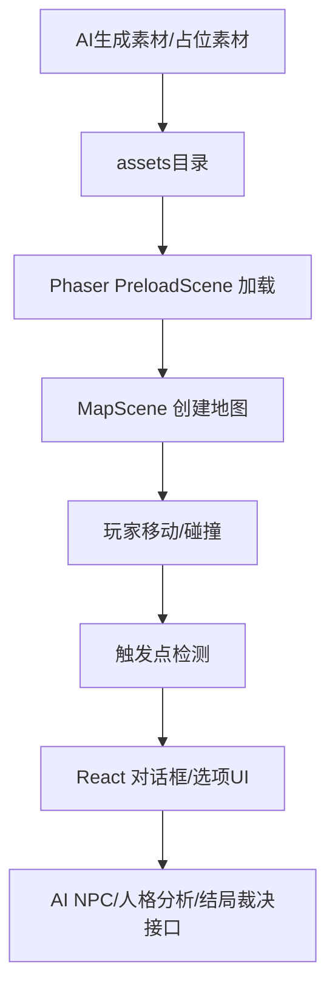
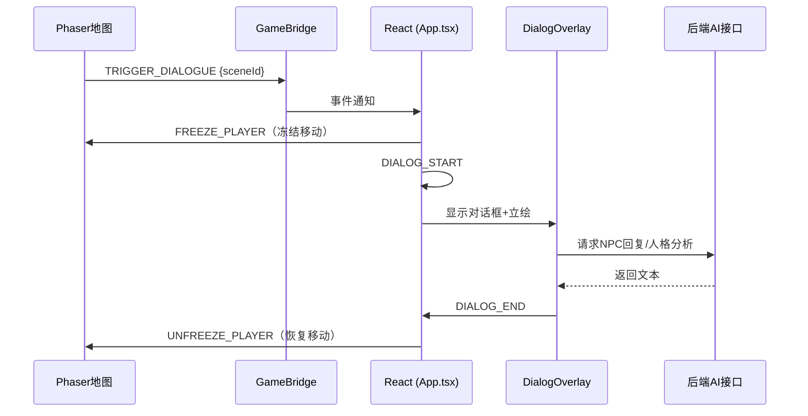

# 05｜Phaser资源加载框架说明 v0.1

> 用途：给 CodeBuddy/编程 AI 查看，说明如何加载 AI 生成的地图、角色、UI、特效、音频。当前目标：先用占位素材跑通，再替换为 AI 素材。

## 1. 技术结构概览



## 2. 目录结构建议

```text
client/
  src/
    game/
      scenes/
        BootScene.ts
        PreloadScene.ts
        MapScene.ts
      bridge/
        GameBridge.ts
      config/
        assetManifest.ts
        mapRegistry.ts
        animationRegistry.ts
      systems/
        PlayerController.ts
        InteractionSystem.ts
        TriggerSystem.ts
      types/
        gameMap.ts
    components/
      PhaserContainer.tsx
      DialogOverlay.tsx
  public/
    assets/
      maps/
        livingroom/map.json
        livingroom/客厅.png
        bedroom/map.json
        bedroom/主角房间.png
        bathroom/map.json
        bathroom/卫生间.png
      sprites/yps.png
      portraits/yps_defult.png
      portraits/ly_smile.png
      ui/dialogue_box.png
      effects/
      audio/
```

> **已删除**：`bg/` 和 `characters/` 文件夹。场景背景改用 Phaser 像素地图，角色改用 `portraits/` 立绘。

## 3. AssetManifest 示例

> 角色精灵图统一为 256×256 px 单张 Sprite Sheet，Phaser 按行列手动切帧。

```ts
export const AssetManifest = {
  maps: {
    bedroom: {
      key: "map_bedroom",
      json: "/assets/maps/bedroom/map.json",
      tilesetKey: "tileset_bedroom",
      tilesetImage: "/assets/maps/bedroom/tileset.png",
    },
    classroom: {
      key: "map_classroom",
      json: "/assets/maps/classroom/map.json",
      tilesetKey: "tileset_classroom",
      tilesetImage: "/assets/maps/classroom/tileset.png",
    },
  },
  sprites: {
    yps: {
      key: "sprite_yps",
      image: "/assets/sprites/yps.png",
      // 256×256 单张 Sprite Sheet，按行手动切帧
      // 行0: idle 3帧, 行1: run 4帧, 行2: attack 4帧, 行3: hit 3-4帧
      // 每帧约 17×40 px，行间距24px，帧间距25px
    },
    liuyu: {
      key: "sprite_liuyu",
      image: "/assets/sprites/liuyu.png",
    },
  },
  portraits: {
    yps_default: {
      key: "portrait_yps_default",
      image: "/assets/portraits/yps_default.png",
    },
    liuyu_smile: {
      key: "portrait_liuyu_smile",
      image: "/assets/portraits/liuyu_smile.png",
    },
  },
  effects: {
    suffocation: {
      key: "fx_suffocation",
      image: "/assets/effects/suffocation.png",
    },
  },
  audio: {
    systemBeep: {
      key: "sfx_system_beep",
      path: "/assets/audio/sfx_system_beep.mp3",
    },
  },
} as const;
```

待填：

```text
实际地图列表：
实际 sprite 列表：
实际 UI 资源：
实际音频：
```

## 4. PreloadScene 职责

- 加载 Tiled 地图 JSON
- 加载 tileset 图片
- 加载角色 sprite sheet（256×256 单张，手动切帧）
- 加载立绘、UI、特效、音频
- 显示加载进度
- 加载完成后进入主地图

伪代码：

```ts
export class PreloadScene extends Phaser.Scene {
  constructor() {
    super("PreloadScene");
  }

  preload() {
    Object.values(AssetManifest.maps).forEach((map) => {
      this.load.tilemapTiledJSON(map.key, map.json);
      this.load.image(map.tilesetKey, map.tilesetImage);
    });

    // 角色精灵图：加载整张 256×256 图片，切帧在 AnimationRegistry 中处理
    Object.values(AssetManifest.sprites).forEach((sprite) => {
      this.load.image(sprite.key, sprite.image);
    });

    // 立绘
    Object.values(AssetManifest.portraits || {}).forEach((portrait) => {
      this.load.image(portrait.key, portrait.image);
    });
  }

  create() {
    this.scene.start("MapScene", { mapId: "bedroom" });
  }
}
```

## 5. MapRegistry 示例

```ts
export const MapRegistry = {
  bedroom: {
    mapKey: "map_bedroom",
    tilesetNameInTiled: "tileset_bedroom",
    tilesetKey: "tileset_bedroom",
    defaultSpawn: "spawn_bedroom_start",
    bgm: null,
  },
  classroom: {
    mapKey: "map_classroom",
    tilesetNameInTiled: "tileset_classroom",
    tilesetKey: "tileset_classroom",
    defaultSpawn: "spawn_classroom_door",
    bgm: "bgm_classroom",
  },
} as const;
```

## 6. AnimationRegistry 示例

> Sprite Sheet 布局（256×256 px）：
> - 行0 (y:12-51, 高40px): 站立/idle 3帧
> - 行1 (y:76-116, 高41px): 跑步/run 4帧
> - 行2 (y:140-180, 高41px): 攻击/attack 4帧
> - 行3 (y:205-244, 高40px): 受击/hit 3-4帧
>
> 由于帧间距不规则（非等分网格），需用 `generateFrameNumbers` 手动指定每帧的区域。

```ts
// 精灵图帧坐标定义（基于 yps.png 的实测布局）
const SPRITE_FRAME_ROWS = {
  idle:    { y: 12,  height: 40, frames: 3, frameWidths: [17, 16, 16], xStarts: [10, 42, 74] },
  run:     { y: 76,  height: 41, frames: 4, frameWidths: [17, 16, 16, 17], xStarts: [10, 42, 74, 105] },
  attack:  { y: 140, height: 41, frames: 4, frameWidths: [17, 16, 16, 17], xStarts: [10, 42, 74, 105] },
  hit:     { y: 205, height: 40, frames: 3, frameWidths: [17, 16, 16], xStarts: [10, 42, 74] },
} as const;

export function createPlayerAnimations(scene: Phaser.Scene) {
  // 站立/idle 动画
  scene.anims.create({
    key: "yps_idle",
    frames: scene.anims.generateFrameNumbers("sprite_yps", {
      start: 0,
      end: 2,
    }),
    frameRate: 4,
    repeat: -1,
  });

  // 跑步/run 动画
  scene.anims.create({
    key: "yps_run",
    frames: scene.anims.generateFrameNumbers("sprite_yps", {
      start: 3,
      end: 6,
    }),
    frameRate: 8,
    repeat: -1,
  });

  // 攻击/attack 动画
  scene.anims.create({
    key: "yps_attack",
    frames: scene.anims.generateFrameNumbers("sprite_yps", {
      start: 7,
      end: 10,
    }),
    frameRate: 10,
    repeat: 0,
  });

  // 受击/hit 动画
  scene.anims.create({
    key: "yps_hit",
    frames: scene.anims.generateFrameNumbers("sprite_yps", {
      start: 11,
      end: 13,
    }),
    frameRate: 8,
    repeat: 0,
  });
}
```

> **注意**：由于帧间距不规则，实际开发时需在 PreloadScene 中手动将每帧裁切为独立纹理，
> 或使用 Phaser 的 `spritesheet` 配合自定义 `getFrameOffsets` 回调。
> 上面的 `generateFrameNumbers` 方案仅作为逻辑示意，具体切帧方式需根据引擎能力调整。

## 7. Tiled 对象属性建议

| 属性名 | 用途 | 示例 |
|---|---|---|
| type | 触发类型 | dialogue / item / door / effect |
| sceneId | 剧情节点 | scene_read_planbook |
| targetMap | 目标地图 | classroom |
| spawnId | 目标出生点 | spawn_classroom_door |
| npcId | NPC编号 | liuyu |
| itemId | 物件编号 | planbook |
| requireFlag | 前置条件 | has_3class_permission |
| setFlag | 触发后设置条件 | read_family_rule |

## 8. React 与 Phaser 交互桥

当前采用**融合架构**：Phaser 地图始终可见，对话以 DialogOverlay 浮动叠层呈现。



> **关键变化**：不再使用"双模式切换"（explore ↔ narrative），Phaser 场景**始终可见**。对话作为叠层显示在 Phaser 上方。

事件定义：

```ts
// Phaser → React（触发事件）
type PhaserToReactEvent =
  | { type: "TRIGGER_DIALOGUE"; sceneId: string; mapId: string }
  | { type: "TRIGGER_ITEM"; itemId: string; mapId: string }
  | { type: "TRIGGER_DOOR"; targetMap: string; spawnId: string };

// React → Phaser（控制指令）
type ReactToPhaserCommand =
  | { type: "CHANGE_MAP"; mapId: string; spawnId: string }
  | { type: "FREEZE_PLAYER" }
  | { type: "UNFREEZE_PLAYER" };
```

## 9. CodeBuddy 任务清单

```text
请根据本文件生成 Phaser + React 的资源加载系统：
1. 创建 AssetManifest；
2. 创建 PreloadScene；
3. 创建 MapRegistry；
4. 创建 MapScene；
5. 读取 Tiled 对象层 Triggers/NPC/Items；
6. 实现玩家移动与碰撞；
7. 实现按 E 键交互；
8. 通过 DialogueBridge 通知 React 显示剧情；
9. 支持后续替换 AI 生成素材。
```

## 10. 待补充

- [ ] 实际项目目录
- [ ] Tiled JSON样例
- [ ] 第一张地图加载测试结果
- [ ] React DialogueBridge 真实代码
