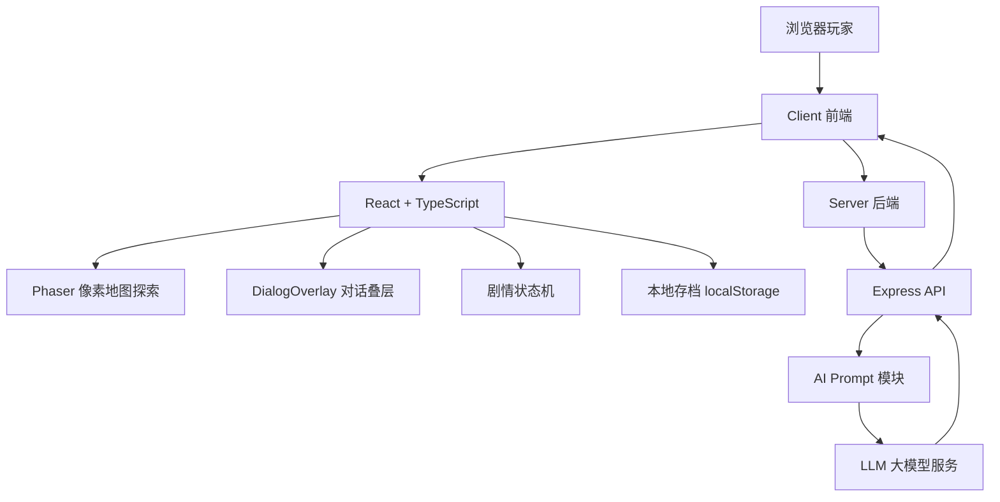
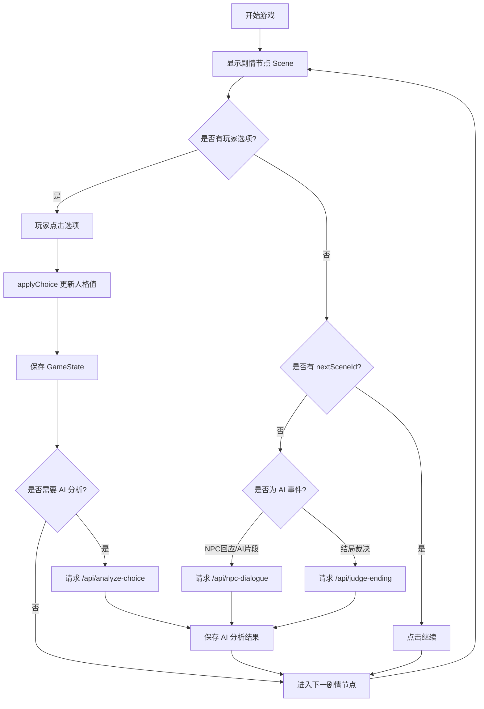
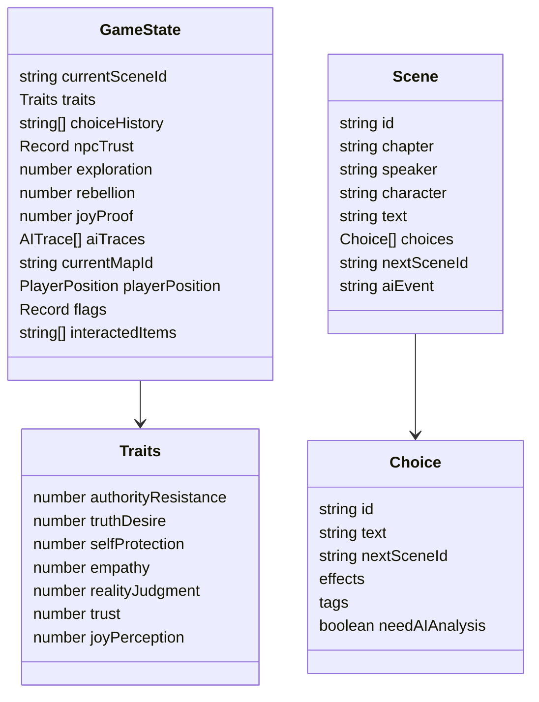
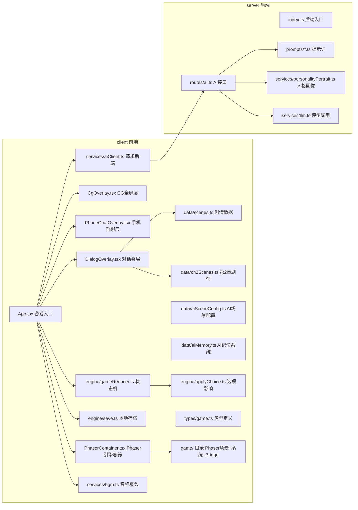
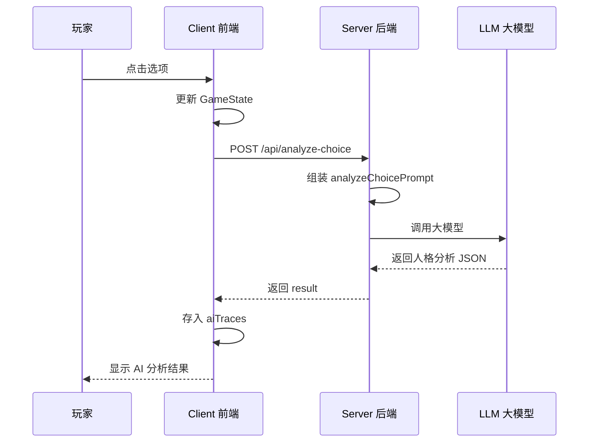
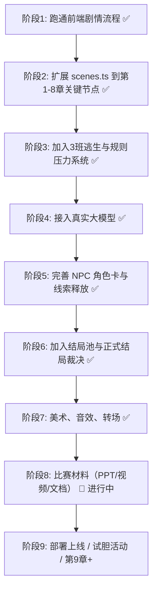

# 《快乐小孩》AI 叙事游戏项目说明

本文档用于给编程 AI、团队成员或后续开发者快速理解项目结构。

## 1. 项目目标

制作一个可在浏览器中运行的 AI 叙事视觉小说原型。

核心体验：

> 玩家在副本《快乐小孩》中做出选择，系统记录选择历史并形成玩家人格画像；AI 根据玩家画像动态调整 NPC 线索释放与结局裁决，使结局不再是固定路线奖励，而是玩家长期选择自然导向的命运结果。

## 2. 技术栈

后端支持三种模式，由环境变量 `MODEL_PROVIDER` 控制：`openai`（OpenAI API）、`hunyuan`（腾讯混元）、`mock`（离线兜底）。AI 生成失败时自动回退到 hand-written fallback 文本。

## 3. 总体玩法流程

## 4. 前端状态结构

核心状态在 `client/src/types/game.ts` 的 `GameState` 中定义。

> **架构变更（2026-05）**：游戏不再采用 explore/narrative 双模式切换架构。改为**融合架构**——Phaser 像素地图始终可见，剧情触发时以 DialogOverlay 浮动叠层显示对话。因此 GameState 中不再有 `mode` 字段，改为通过 `DIALOG_START`/`DIALOG_END` 控制对话框的显示/隐藏。Scene 中 `background` 字段已弃用（场景由 Phaser 实时渲染）。

## 5. 文件职责总览

## 6. 关键模块说明

### 6.1 剧情节点 `data/scenes.ts`

每个 `Scene` 是一个视觉小说节点。

最常见三类节点：

1. 普通剧情节点：有 `nextSceneId`，点击"继续"进入下一段。
2. 选择节点：有 `choices`，点击选项后修改人格值并跳转。
3. AI事件节点：有 `aiEvent`，点击"启动 AI 分析"请求后端。

添加新剧情时，只需要新增一个 scene，然后让前一个节点的 `nextSceneId` 或某个 choice 指向它。

AI事件节点进一步分为：

- `AI回应`：只生成 NPC 的简短台词，适合低成本闲聊和态度反馈。
- `AI片段`：生成一段可控剧本小场景，可包含 `[旁白]`、`[主角]`、`[主角说]`、`[NPC:名字]` 和必要的 NPC动作。
- `AI判定`：只更新玩家画像、NPC印象或结局归因，不直接展示完整对话。

`AI片段` 用于关键关系节点和动态过渡，必须在剧本中写清固定事实、输出格式、必说台词和固定跳转。

### 6.2 人格画像 `traits`

当前有七个维度，对应**认知→行动→影响**三层评判框架：

| 层次 | 字段 | 中文名 | 用途 |
|---|---|---|---|
| **认知层** | `truthDesire` | 真相欲望 | 是否愿意追问副本本质；衡量玩家是否看见了真实自我 |
| **认知层** | `joyPerception` | 快乐感知 | 是否能从功利评价之外感受生命；认同"我"只是第一步 |
| **行动层** | `authorityResistance` | 权威抵制度 | 是否质疑父母、老师、学校规则；区分"无脑叛逆"与"建设性叛逆" |
| **行动层** | `realityJudgment` | 现实判断 | 是否知道什么时候退让、什么时候冒险；防止高反抗但低策略导致自毁 |
| **行动层** | `selfProtection` | 自我保护 | 是否保留筹码、避免暴露；但是否因过度保护而无所作为 |
| **影响层** | `empathy` | 共情能力 | 是否理解 NPC 与"我"的痛苦；是否尝试影响周围的人 |
| **影响层** | `trust` | 关系信任 | 是否愿意与 NPC 合作；真正的进化是打破丛林法则，为世界带来光 |

**设计理念**：
- 认知层：认同"我"只是第一步，认知提高是前提但不是最终目的。
- 行动层：做出成果才是实在的，反对"无病呻吟"；区分"破坏性叛逆"与"建设性叛逆"。
- 影响层：真正的进化不是"证明自己"，而是"为世界带来光"；打破丛林法则，在系统缝隙里做出小选择。

### 6.3 AI 分析边界

AI 可以做：

- 分析玩家选择体现出的人格倾向。
- 根据玩家画像生成 NPC 的表达方式。
- 生成受控的动态小场景（`AI片段`），包括旁白、主角反应和 NPC 台词。
- 决定 NPC 释放线索的等级。
- 在预设结局中选择最符合玩家的结局。
- 生成个性化旁白。

AI 不可以做：

- 临时创造新的主线真相。
- 改写角色核心设定。
- 覆盖剧本中标注的"必说台词"。
- 直接告诉玩家所有答案。
- 跳过关键剧情节点。
- 随机生成不受控结局。

`AI片段` 额外约束：

- 不能生成新选项。
- 不能生成未指定跳转。
- 不能改变固定剧情结果。
- 必须保留小说原文中被标记为"必说台词"的关键发言。
- 如果 AI 输出不符合格式，应回退到剧本中的固定台词或默认短回应。

## 7. AI 接口流程

## 8. 当前版本能做什么

以下功能均已实装并可运行：

### 核心玩法

- **融合探索与叙事**：Phaser 像素地图始终可见，对话以浮动叠层呈现。
- WASD 移动主角，E 键交互，step-on trigger 自动触发。
- 通过 GameBridge 事件总线在 Phaser 和 React 之间通信。

### 地图系统

- **22 个完整像素地图**：livingroom / bedroom / bedroom_parents / bedroom_luggage / bathroom / kitchen / balcony / balcony_night / dormitory / dormitory_day / dormitory_act4 / classroom / classroom_3 / corridor / gate / gate_night / rooftop / teacher_office / wang_gallery / waiting / shop / shop_school
- 地图由 `map_editor.html` 可视化编辑生成 `map.json`，含碰撞体、触发器、spawn 点

### 演出层

- 底部浮动 **DialogOverlay**：角色立绘（主角左/NPC右/旁白无）+ 紧凑选项 + 打字机效果
- **CG 全屏模式**：关键剧情节点切换 CG 背景 + 底部选项
- **手机群聊层**：模拟微信聊天界面，用于群聊剧情演出
- **对话历史回顾**（Backlog）
- **笔记本面板**（线索/规则记录）
- **人格画像展示**（6 种人格倾向图形化展示）

### AI 系统

- 5 个 API 端点：`/api/analyze-choice` / `/api/npc-dialogue` / `/api/generate-scene` / `/api/judge-ending` / `/api/personality-portrait`
- **22 个 AI 动态场景**，支持真实 LLM 生成（OpenAI + 腾讯混元），含完整 fallback 文本兜底
- AI 三层约束机制：`skeletonLines`（内容骨架）→ `structureSection`（强制结构顺序）→ `context`（剧情约束）
- AI 记忆系统（`aiMemory.ts`）：维护主角画像、世界观、NPC 印象、重要事件

### 数据系统

- **8 章完整剧本**：240+ 场景节点（`scenes.ts` 345KB + `ch2Scenes.ts` 37KB）
- 七维人格画像（认知→行动→影响三层框架）
- 6 种人格倾向（凿孔者/守灯者/边界行者/拾光者/燃火者/观测者）
- 6 个结局池（好孩子/坏孩子/旁观者/救世主幻觉/凿孔者/快乐小孩）
- Flag 驱动的条件分支：`dorm_act2`、`dorm_act2_exploring` 等

### 音频系统

- 11 首 BGM，按场景自动切换
- 场景音效（闹钟、开门、雨声等），支持 loop 模式
- 音量设置面板（BGM/SFX 独立调节）

### 存档系统

- 多槽位存档/读档
- 运行时地图快照存档（含玩家位置、地图状态）
- localStorage 持久化

## 9. 开发路线（已完成 → 后续）

### 已完成（Demo v1.0）

- 8 章完整剧本闭环（序章→家庭→学校→天台和解→结局裁决）
- 22 个像素地图 + 融合探索架构
- 真实 AI 集成（OpenAI / 混元，含 fallback）
- 22 个 AI 动态场景
- 六种人格倾向 + 六结局裁决系统
- 手机群聊演出层
- 11 首 BGM + 场景音效
- 多槽位存档/读档

### 待继续（比赛后）

- 试胆活动（第 9 章+）
- 湖中遗物、书中落叶谜题
- 镜中空间完整实现
- 违规压力 UI
- 在线部署与公开体验

## 10. 给编程 AI 的注意事项

1. 不要把剧情写死在 React 组件里，应写在 `data/scenes.ts`。
2. 不要在前端放任何大模型 API Key。
3. 不要让 AI 直接改写主线事实，AI 只负责分析、表达、受控片段生成与裁决。
4. 选项影响应优先修改 `traits`，不要直接跳到"好结局/坏结局"。
5. 新增功能时先保证 TypeScript 编译通过。
6. 每次新增 scene，都要确认 `nextSceneId` 指向存在的节点。
7. 比赛 Demo 目标是"短而完整"，不要一开始做开放世界。
8. 使用 `AI片段` 时，必须先在剧本中写明固定事实、必说台词、允许输出格式和固定跳转。
9. **地图与剧本解耦**：`map.json` 由 `map_editor.html` 维护，剧情修改尽量通过 spawnId 引用适配，不直接改 map.json。
10. **AI 场景强制结构**：当 `skeletonLines` + `requiredLines` 同时存在时，`sceneFragment.ts` 自动生成 4 阶段强制结构，确保 AI 不自行调整对话顺序。
11. **闭包陈旧问题**：`PhaserContainer` 中 `useEffect([])` 导致回调引用过期，需用 `useRef` 保存 `onDialogueTrigger` 和 `dispatch` 最新引用。
12. **添加 NPC 三步流程**：PreloadScene 加载精灵 → MapScene 处理 spawn/npc 事件 → App.tsx 在适当时机发送 STORY_EVENT。
